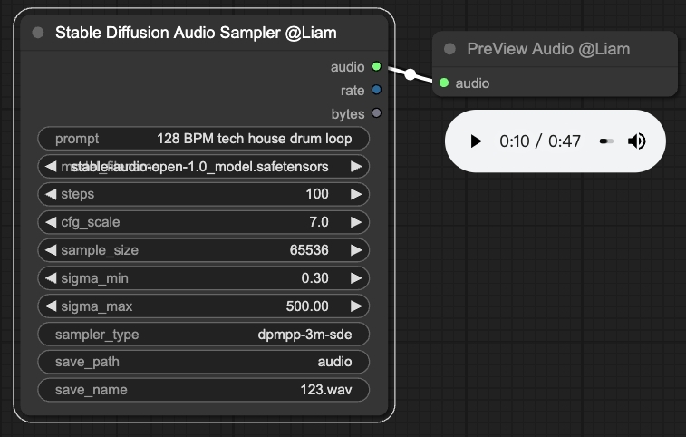

# ComfyUI-StableAudioSampler
The New Stable Audio Open 1.0 Sampler In a ComfyUI Node. Make some beats!

Fork from :https://github.com/lks-ai/ComfyUI-StableAudioSampler

## Requirements
- At least 7GB VRAM
- ComfyUI

## Installation
1. Make sure you have your `HF_TOKEN` environment variable for hugging face because model loading doesn't work just yet directly from a saved file
2. Go ahead and download model from here for when we fix that [Stable Audio Open on HuggingFace](https://huggingface.co/stabilityai/stable-audio-open-1.0/blob/main/model.safetensors)
3. Make sure to run `pip install -r requirements.txt` inside the repo folder if you're not using Manager
4. It should just run if you've got your environment variable set up

There will definitely be issues because this is so new and it was coded quickly so we couldn't test it out.

This is not an official StableAudioOpen repository.

## Current Features
- Uses HuggingFace
- Generates audio and outputs raw bytes and a sample rate
- Includes all of the original Stable Audio Open parameters
- Can save audio to file

## Roadmap and Requested Features
Keeping track of requests and ideas as they come in:
- Audio to Audio (like in the Gradio Example)
- Output to VHS Video Encoder Format
- Stereo output
- Model loading from the `models/audio_checkpoints` folder
- Seed control with `control_after_generate` option
- Nodes
  - A Mixer Node (mix your audio outputs with some sort of mastering)
  - A Tiling Sampler (concatenate the audios)
  - A Model Loader Node (to load audio models separately and pipe to wherever)
- Making the Audio format compatible with other Audio Node packs
- A bit of Refactoring cause this was a quick release
- More Sampler Node Options
  - Gain
  - Possibly Clipping at some dB
  - Cleaning up some of the current options with selectors, etc.
  - Negative Prompts
- Looking at Putting in InitAudio tomorrow so we can see Melspectograms (cause that looks bad ass, saw the gradio)
 
We are very open to anyone who wants to contribute from the open source community. Make your forks and pull requests. We will build something cool.

# Feature Requests
If you have a request for a feature, open an issue about it and it will be seen.

Happy Diffusing!
